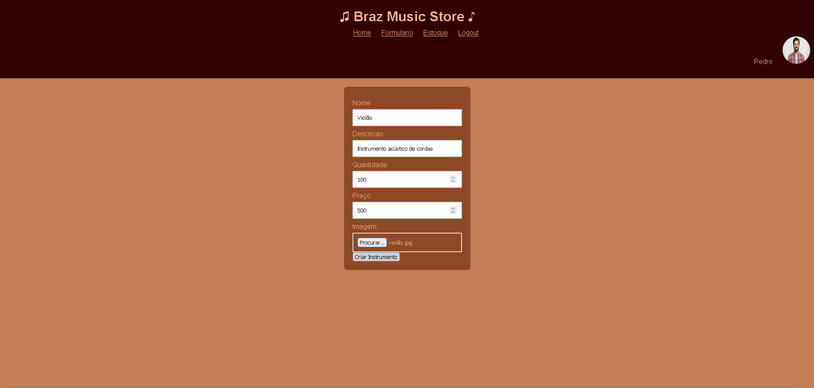
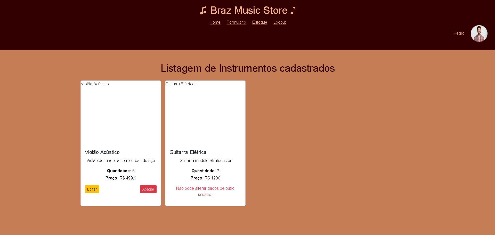

*Sistema de Controle de Estoque*

Aplicação web para gerenciamento de produtos em estoque.

*Funcionalidades*
- Cadastro de produtos
- Controle de quantidade
- Sistema de login

*Tecnologias*
- Node.js
- JavaScript
- MySQL

*Como executar*

1. Instale as dependências:
npm install

2. Configure o banco de dados

3. Inicie o servidor:
npm start

Tela inicial
 

Usuário Logado:
 

Cadastrar um produto:
 

Estoque dos produtos:
 

